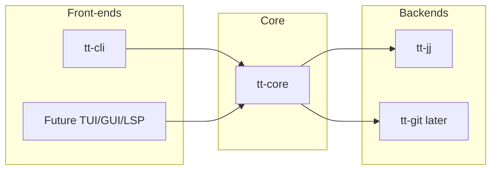

# Implementation specification: task-tree

This document fully specifies how to implement the task-tree (`tt`) CLI. It prescribes tech stack, architecture, implementation order, workflow, testing strategy, and command-by-command behavior. The behavioral specification and data formats are defined in [DESIGN.md](DESIGN.md); this document adds implementation choices and structure.

**Relationship to DESIGN.md:** DESIGN.md is the source of truth for semantics, data formats, commands, and algorithms. IMPLEMENTATION.md does not override DESIGN.md; it specifies how to build the tool so that it conforms to DESIGN.md.

---

## Bootstrapping

The project should be **bootstrapped** using tt itself for task management. Progress on the implementation is represented as tasks in a tt task tree: create top-level tasks that correspond to the work (e.g. Phase 0, each command, or other coarse-grained units). Initially, when the tool does not yet exist or only partially exists, set up that structure by **manually** creating the VCS branches and **manually** creating or editing the task files (`.tt/task/...`) and any parent `subtask:` frontmatter so that the task tree and branches match DESIGN.md’s model. As the tool gains functionality, **gradually use tt for day-to-day work**: create new tasks with `tt task create`, switch context with `tt task checkout`, merge completed work with `tt task checkin`, and use `tt task list` and related commands to view and manage the tree. The repository thus becomes both the implementation of tt and a working example of its own workflow; new commands are developed and then used to manage the next slice of work.

---

## 1. Tech stack

- **Language:** Rust. Target a single binary with no runtime dependency; no interpreter.
- **CLI:** Use [clap](https://docs.rs/clap/) (derive or builder) for the `tt` binary: subcommands, arguments, and aliases as in DESIGN §5.
- **VCS:** jj (Jujutsu) only in the first iteration. Communicate with jj by **subprocess**: shell out to the `jj` CLI. Do not use jj as a library in the first iteration.
- **Crate layout:** Use a Rust **workspace** with separate crates so that backends and front-ends can be swapped later:
  - **tt-core** — Domain model, task tree, task file formats (frontmatter, task ID, branch naming per DESIGN §3–§4), todo-list generation logic (DESIGN Appendix A). No I/O to VCS or filesystem; no subprocess calls. Front-end-agnostic (no CLI-specific types).
  - **tt-jj** — Implementation of the VCS abstraction (see §2) that talks to jj via subprocess. Depends on tt-core only for types/traits defined in the core.
  - **tt-cli** — CLI entrypoint: clap setup, argument parsing, and dispatch into tt-core and tt-jj. Depends on tt-core and tt-jj.

Future: optional **tt-git** (same VCS trait as tt-jj), and/or other front-ends (TUI, GUI, LSP) that depend on tt-core and a backend crate only.

---

## 2. Architecture

### 2.1 VCS abstraction

All repository and branch operations go through a **VCS trait** (defined in tt-core). tt-core must never shell out or perform filesystem I/O for VCS operations; it receives an implementation of this trait (injected or selected by tt-cli).

- **tt-core** defines the trait (e.g. methods for: list branches, get branch parent, create branch, merge, worktree operations, read file at revision, etc.) and uses it to implement todo-list generation, checkin validation, and all other domain logic that depends on repo state.
- **tt-jj** implements the trait by invoking the `jj` CLI in a subprocess and parsing output as needed.
- Later, **tt-git** can implement the same trait for git.

Introduce this trait from day one; do not defer abstraction until a second backend exists.

### 2.2 Front-end-agnostic core

tt-core exposes APIs that are not CLI-specific: e.g. “create task”, “get todo list (full or focused)”, “run checkin”, “propagate”, “checkout task”. tt-cli’s role is to parse user input, call these APIs with the appropriate VCS implementation, and format stdout/stderr. This keeps the door open for a TUI, GUI, or LSP that reuses tt-core without duplicating logic.



---

## 3. Implementation order

Work **command by command**, including each command’s hooks (DESIGN §8). Phase 0 sets up the test harness; then implement the read-only **`tt task list`** first, then the rest in the order below. Each command except Phase 0 is implemented using **strict TDD** (red → green → refactor). Phase 0 does not need to be red/green tested.

1. **Phase 0 — Test harness**  
   Set up the scenario runner, manifest format, scenario directory layout, shared assertion helpers, mock VCS backend (§6), and (optionally) real jj temp-repo wiring for e2e. No requirement to TDD this phase.

2. **`tt task list`** — Read-only. Full list and `--focus`; filtering `--project` / `--detached` / `--all`. Todo list generation per DESIGN Appendix A. No hooks.

3. **`tt workspace init`** — Virtual project dir, `.tt/config.toml`, HEAD symlink. DESIGN §5.1, §6.2, §9 step 1. No hooks in DESIGN §8.

4. **`tt task create`** — Create child task or project: with `--parent`, parent frontmatter update, child branch and task file, `TASK.md` symlink; with `--project`, create project branch and task file. DESIGN §5.2, §6.1. Hooks: **pre-create**, **post-create**.

5. **`tt task checkout`** — Switch to task branch; worktree behavior, HEAD symlink. DESIGN §5.2, §6.2. Hooks: **setup** (new worktree), **pre-checkout**, **post-checkout**.

6. **`tt task checkpoint`** — Commit WC changes or advance bookmark to parent; ancestry check; optional commit message. DESIGN §5.2, §6.3. Hooks: **pre-checkpoint**, **post-checkpoint**.

7. **`tt task checkin`** — Validation (DESIGN §6.5), checkin commit, merge. DESIGN §5.2, §6.4, §6.5. Hooks: **pre-checkin**, **pre-receive**, **post-receive**.

8. **`tt task show`** — Current task and branch; status of direct children from current task file frontmatter; optional `<task-id>` arg for explicit lookup. DESIGN §5.2. No hooks.

9. **`tt task propagate`** — Rebase/merge descendants onto parent tip; worktree sync. DESIGN §5.2, §6.7. Hooks: **pre-propagate**, **post-propagate**.

10. **`tt task reorder`** — Reorder direct child via parent frontmatter. DESIGN §5.2, §6.6. No hooks.

11. **`tt task remove`** — Remove direct child from current task frontmatter (branch/file unchanged). DESIGN §5.2, §6.6. Hooks: **pre-remove**, **post-remove**.

---

## 4. Implementation workflow

Use **strict TDD** for every command after Phase 0.

For each command (or each significant slice within a command):

1. **Red:** Write failing tests (unit and/or scenario-based integration or e2e, as appropriate).
2. **Green:** Implement the minimum code to pass the tests.
3. **Refactor:** Improve structure and naming without changing behavior.

**Order:** Follow §3: Phase 0, then `tt task list`, then the remaining commands in the order listed. Do not skip ahead; each command may depend on the previous ones.

---

## 5. Testing strategy

### 5.1 Unit tests

- **Location:** tt-core (and tt-jj where useful for parsing or error handling).
- **Scope:** Pure logic only: task tree building, “where to read” rule (DESIGN Appendix A step 2), frontmatter parsing, task ID/branch naming (DESIGN §3), validation rules (e.g. checkin validation DESIGN §6.5). No VCS involvement; use in-memory or stub data.

### 5.2 Scenario-based tests: one harness, two backends

The same **manifest-driven scenario runner** and **shared assertion helpers** are used for two kinds of tests. The only difference is which VCS backend is used.

#### 5.2.1 Integration tests (mock VCS)

- **Backend:** A **mock implementation of the VCS trait** that simulates the requisite jj behavior (branches, worktrees, merge, read file at revision, etc.) in memory.
- **Flow:** The test loads scenario data from the manifest and scenario path, arranges fixture state via the mock (e.g. create branches, set task file contents), runs tt-core/tt-cli against the mock, and asserts outcomes using shared helpers.
- **Benefits:** Fast, in-memory, and **introspectable** (e.g. inspect branch set or task file state directly in the mock). Ideal for rapid iteration and for asserting precise internal state. No real jj or temp repo required.

#### 5.2.2 End-to-end tests (real jj)

- **Backend:** The **real jj backend** (tt-jj) with a **temp repo** on disk.
- **Flow:** The same scenario format and assertion helpers can be reused. The test sets up the temp repo via the real `jj` CLI (or equivalent), runs the tt CLI, and asserts outcomes (stdout, repo tree, task files).
- **Benefits:** Sanity check that the actual jj integration behaves correctly. Slower and less introspectable than mock-based integration tests.

#### 5.2.3 Harness details

- **Manifest:** A manifest file references a scenario filesystem path (exact format and schema are left to the implementer).
- **Scenario path:** Rust test code reads scenario files from that path (e.g. initial branch/task state, expected stdout, expected `.tt/task` state).
- **Per-test setup:** Each test sets up its own fixture (in-memory mock state or temp jj repo).
- **Shared helpers:** Provide “run tt”, “assert repo tree”, “assert task file”, “assert stdout”, etc., so tests stay short and consistent.

---

## 6. Command specifications

The following sections specify each command and Phase 0 in enough detail to implement them. Cross-references to DESIGN.md are given for full semantics and data formats.

### 6.0 Phase 0 — Test harness

- Implement the **scenario runner**: discovery of scenarios from a manifest (or convention), loading of scenario files from the referenced path.
- Define **manifest format** and **scenario directory layout** (e.g. initial tree, expected outputs). Document them in the test crate or in this section.
- Implement **shared assertion helpers** for scenario-based tests: e.g. run tt (or tt-core API) with a given backend, assert stdout/stderr, assert task file contents, assert branch set or worktree state where the backend allows introspection.
- Implement a **mock VCS backend** that implements the VCS trait: in-memory branches, worktrees, merge, file contents per revision. It must support enough operations to run tt-core and tt-cli for all commands (list, init, new, checkout, checkin, status, show, propagate, reorder, remove). Design the mock so that tests can set up fixture state and introspect state after runs.
- Optionally: **real jj e2e wiring** — helper to create a temp directory, run `jj init`, and run tt against it; reuse the same assertion helpers where applicable (e.g. stdout, file contents on disk).

Phase 0 is not required to be developed under TDD.

---

### 6.1 `tt task list`

- **Design reference:** DESIGN §5.2, §4.1, §7.1, §7.2, Appendix A.
- **Behavior:**
  - **Full list:** `tt task list` (with optional `--project <project-id>` repeatable, `--detached`, `--all`). Generate the project todo list per DESIGN Appendix A.1: enumerate project branches, traverse each project's subtree via `subtask:` entries, for each discovered task determine where to read its file (merged vs ongoing), filter by `--project`/`--detached`/`--all`, emit markdown per DESIGN §4.1. Orphaned tasks excluded by default; with `--detached`, add detached section; with `--all`, show all sections.
  - **Focused list:** `tt task list --focus`. Generate the focused todo list per DESIGN Appendix A.2: resolve current task, walk to project via frontmatter parent chain, load task files with same “where to read” rule, emit same markdown format for the subset.
- **Output:** Markdown to stdout only. No hooks.
- **TDD:** Start with unit tests in tt-core for “where to read” and project-based tree building; then scenario tests (mock VCS) for full and focused list; optionally e2e with real jj.

---

### 6.2 `tt workspace init`

- **Design reference:** DESIGN §5.1, §6.2, §9 step 1.
- **Signature:** `tt workspace init <path-to-repo> <path-to-virtual-project-folder> [--task-prefix <prefix>] [--project-prefix <prefix>]`. Alias: `tt init`.
- **Preconditions:** Clean working directory in the repo; no existing `.tt` in the repo root. Otherwise abort with an error.
- **Behavior:** Create the virtual worktree directory at `<path-to-virtual-project-folder>`. In the repo root, create `.tt/config.toml` with optional task prefix (default `task/`) and project prefix (default `project/`) per DESIGN §3. Create a `HEAD` symlink in the virtual project folder that initially points to the repo; it will be updated on each `tt task checkout` to the most recently checked-out task workspace.
- **No hooks** in DESIGN §8.

---

### 6.3 `tt task create`

- **Design reference:** DESIGN §5.2, §6.1, §3 (task ID, branch and file naming).
- **Signature:** `tt task create [--parent <parent-task-id> | --project [--target <commit-rev>]] [--slug <slug>] [--title <title>] [--description <description>] [--label <label> ...] [--propagate [<propagate-flags>]] [--force]`. Alias: `tt create`. `--parent` and `--project` are mutually exclusive.
- **Behavior (summary):**
  - **With `--parent`** (default: current branch): If parent branch has multiple parents (merge commit), refuse. Create a commit **on the parent’s branch** that adds `subtask: [ ] <task-id>` to the parent task file. Create the child branch from that commit. On the child branch, create the task file (`.tt/task/<slug>-<hex>.md`) with `status: TODO` and create `TASK.md` symlink in repo root pointing to it. Generate task ID per DESIGN §3 (`task/<slug>-<hex>`). With `--propagate`, run propagate with given flags after creation.
  - **With `--project`:** Create a project task. The project branch forks from the target commit revision, defaulting to the current revision. If the target revision exists within a task tree, refuse. Create the project task file on the project branch. Generate project ID per DESIGN §3 (`project/<slug>-<hex>`).
  - Prompt for title/description if not provided. With `--force`, overwrite if branch already exists.
- **Hooks:** **pre-create** (parent task worktree when `--parent`, current worktree when `--project`; blocking), **post-create** (new task/project worktree if created, else current; optional). Env: see DESIGN §8 table.

---

### 6.4 `tt task checkout`

- **Design reference:** DESIGN §5.2, §6.2.
- **Signature:** `tt task checkout <task-id> [--worktree [=<path>]] [--force]`. Alias: `tt checkout`.
- **Behavior (summary):** With `--worktree`: ensure task is checked out in its own jj workspace (create if necessary). Without `--worktree`: checkout in closest ancestor task workspace or current workspace. Refuse if target workspace has local changes unless `--force`. Update task status to IN-PROGRESS if currently TODO. When creating a new worktree, run **setup** hook (optional / non-blocking). Update virtual project `HEAD` symlink to the task’s workspace.
- **Hooks:** **setup** (new worktree only, optional), **pre-checkout** (current/outgoing worktree, blocking), **post-checkout** (checked-out worktree, optional). Env: see DESIGN §8.

---

### 6.5 `tt task checkpoint`

- **Design reference:** DESIGN §5.2, §6.3.
- **Signature:** `tt task checkpoint [--message <msg>] [--force]`. Alias: `tt checkpoint`.
- **Preconditions (abort if any fail):**
  - Current branch is a task or project branch.
  - The commit the bookmark will be moved to is a strict descendant of the current bookmark tip. `--force` bypasses this check.
- **Behavior (two cases):**
  - **Empty WC:** If `--message` is provided, update the parent commit's description (`jj describe @-`). Move the bookmark to `@-`.
  - **Non-empty WC:** Run `jj commit [-m <message>]` to create a new commit from WC changes. Move the bookmark to the newly created commit (`@-` after `jj commit`).
  - In both cases, print: `Checkpoint: <task-id> → <commit-id>`.
- **Hooks:** **pre-checkpoint** (current task worktree, blocking), **post-checkpoint** (same, optional). Env: see DESIGN §8.
- **TDD:** Unit tests for ancestry check (both WC-empty and WC-non-empty paths); scenario tests (mock VCS) for each case including `--message` and `--force`.

---

### 6.6 `tt task checkin`

- **Design reference:** DESIGN §5.2, §6.4, §6.5.
- **Signature:** `tt task checkin [--rebase | --merge] [--force] [--delete] [--target <branch>]`. Alias: `tt checkin`.
- **Validation (DESIGN §6.5):** Before merging, run all checks: clean working copy, current task has exactly one parent or is a project task with no parents (project tasks must specify `--target` branch; all other tasks cannot specify `--target`), no incomplete child tasks, no disallowed task file changes in merge range, TASK.md change rule; with `--rebase`/`--merge` optionally propagate first and bail on conflict unless `--force`. Abort on first failure.
- **Behavior (summary):** If `--rebase`/`--merge`, propagate from parent first (bail on conflict unless `--force`). Run **pre-checkin** (child worktree, blocking). Create **checkin commit** on child branch: (a) rewrite `TASK.md` to point to parent’s task file, (b) optionally delete child task file if `--delete`, (c) update parent task file frontmatter so the corresponding `subtask:` is `[x]` and optionally include task title if `--delete`. Merge child into parent. Run **pre-receive** then **post-receive** on parent worktree. Switch worktree to parent, update HEAD symlink, remove child worktree if dedicated.
- **Hooks:** **pre-checkin** (child worktree, blocking), **pre-receive** (parent worktree, blocking), **post-receive** (parent, optional). Env: see DESIGN §8.

---

### 6.7 `tt task show`

- **Design reference:** DESIGN §5.2.
- **Signature:** `tt task show [<task-id>]`. Alias: `tt show`.
- **Behavior:**
  - If `<task-id>` omitted: resolve current branch via `resolve_current`; error if not on a task/project branch.
  - If `<task-id>` given: locate the correct branch using the “where to read” rule (DESIGN Appendix A step 3) — scan all task/project branches for one whose owner task file contains `subtask: [x] <task-id>`; if found, read from that branch; otherwise read from `<task-id>`’s own branch. Error if neither exists.
  - `worktree` field: use `find_worktrees_for_branch` on the resolved branch; take first result; fall back to repo root if none found.
  - Decode `description` field: the frontmatter value is a JSON string literal; pass through `jq -r .` to unescape `\n` and other escape sequences.
- **Output format** (exact):
  ```
  task:     <task-id>
  branch:   <branch-name>
  worktree: <worktree-path>
  status:   <STATUS>
  title:    <title>
  ---

  Subtasks:
  - [cb] <id> <title>
  - ...

  ---

  <description text>

  ```
  Rules: blank line after `---`; blank line before `---` (except after header); trailing blank line after last section. `Subtasks:` section replaced by `[No subtasks]` if empty. Description replaced by `[No description]` if empty.
- **No hooks.**

---

### 6.8 `tt task propagate`

- **Design reference:** DESIGN §5.2, §6.7.
- **Signature:** `tt task propagate [--from=<parent-id>] [--to=<descendant-id>]... [--rebase | --merge] [--shallow] [--force]`. Alias: `tt propagate`.
- **Behavior (summary):** Default: `--from` = current task, `--to` = all descendants (or direct children with `--shallow`). Strategy: rebase by default; `--merge` merges parent into each child. Preconditions: clean WC, no merge at tip, no untracked changes in affected worktrees. Update each target branch so its base is the parent’s current tip (deterministic order: parent before children). Sync worktrees to new commits. With `--force`, proceed despite conflicts (may leave conflict state for user).
- **Hooks:** **pre-propagate** (current/source worktree, blocking), **post-propagate** (same, optional). Env: see DESIGN §8.

---

### 6.9 `tt task reorder`

- **Design reference:** DESIGN §5.2, §6.6.
- **Signature:** `tt task reorder <task-id> <modifier>`. Modifier: one of `--up`, `--down`, `--after <other-task-id>`, `--before <other-task-id>` (mutually exclusive).
- **Behavior:** Update the current task file’s frontmatter to reorder the direct child `<task-id>` relative to siblings. Fail if reorder is impossible (e.g. already first with `--up`, or `<other-task-id>` is not a sibling). Do not modify branches or task files on disk beyond the current task file’s `subtask:` order.
- **No hooks.**

---

### 6.10 `tt task remove`

- **Design reference:** DESIGN §5.2, §6.6.
- **Signature:** `tt task remove <task-id>`. Alias: none in DESIGN; implement per §5.
- **Behavior:** Remove `<task-id>` from the current task file’s `subtask:` frontmatter. The child’s branch and task file are **not** deleted. Run **pre-remove** then **post-remove**.
- **Hooks:** **pre-remove** (parent task worktree, blocking), **post-remove** (same, optional). Env: see DESIGN §8.

---

## 7. Lifecycle hooks (reference)

Hooks are shell scripts or executables under `.tt/hooks/<name>`. Exit 0 = proceed; non-zero = abort (with stderr shown). Missing hook = skipped. Blocking vs optional: pre- hooks are blocking; post- hooks and **setup** are optional (non-zero is reported but does not abort).

Every hook receives at least **TT_WORKSPACE_DIR** and **TT_WORKTREE_DIR**. Full table (when, where, blocking, extra env) is in DESIGN §8. Implement all hooks listed there for the commands that trigger them (§6.3–§6.11).

---

*End of implementation specification.*
